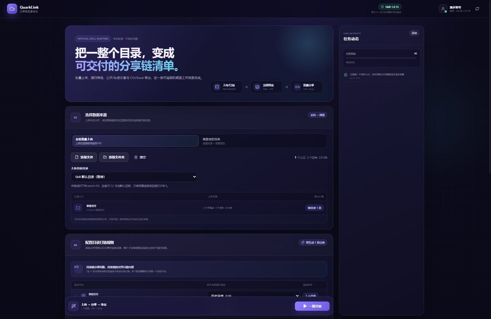

<div align="center">
  
  <h1>夸克分享链批量导出</h1>
  <p><strong>把本机目录或夸克网盘已有内容，整理成可直接交付的分享链清单。</strong></p>
  <p>
    <a href="./README.md">English</a> ·
    <strong>简体中文</strong>
  </p>
  <p>
    <a href="https://github.com/HardToFd/quark-share-exporter/releases/latest">下载</a> ·
    <a href="https://github.com/HardToFd/quark-share-exporter/issues">问题反馈</a>
  </p>
</div>



<p align="center"><sub>使用演示数据渲染的工作台预览，不包含真实账号凭据或用户文件。</sub></p>

## 这个工具做什么

夸克分享链批量导出也称为 **QuarkLink**，把上传、目录选择、分享创建和结果导出整合到一个 Electron 桌面应用中，覆盖两类实际工作流：

- **本机 → 夸克网盘**：保持本机目录结构上传，再使用返回的 FID 创建分享链。
- **夸克网盘 → 导出文件**：浏览或搜索已有网盘内容，选择递归范围后直接创建分享链，无需先下载到本机。

应用支持逐项分享或合并分享、公开或私密链接、永久或限时有效期，并可把结果导出为 CSV 和 Excel。

> [!NOTE]
> 桌面界面目前为简体中文。夸克分享链批量导出是独立社区项目，并非夸克官方产品，与夸克不存在隶属或官方背书关系；网盘能力基于夸克网盘官方 [`quarkclouddrive` Skill v1.0.15](https://pdds.quark.cn/download/stfile/bbhhdeegcbcfbdjdp/quarkclouddrive-1.0.15.zip)。

## 主要特点

- 保持本机多层目录结构上传，不会把内容直接铺平。
- 每个本机目录都能独立设置不打链、仅 L0、向下指定层级或全部后代。
- 网盘浏览采用懒加载：先读取根目录，展开文件夹时再加载下一层。
- 关键词搜索作为补充定位入口，并在可用时读取完整搜索 artifact。
- 逐项分享最多使用 3 个执行单元；合并分享每组最多 100 项。
- 把成功链接、服务端提取码、来源映射和分享失败记录导出为 CSV 与 `.xlsx`。
- 停止任务时保留并导出已经完成的结果。
- 每次执行前使用 SHA-256 校验内置的夸克网盘运行时。

## 下载

从 [GitHub Releases](https://github.com/HardToFd/quark-share-exporter/releases/latest) 下载当前版本。

| 平台 | 选择此文件 | 分发方式 |
| --- | --- | --- |
| Windows 10/11 x64 | `*-Setup-x64.exe` | 安装版 |
| Windows 10/11 x64 | `*-Portable-x64.exe` | 免安装便携版 |
| macOS，Intel 与 Apple Silicon | `*-mac-universal.dmg` | Universal 通用磁盘镜像 |
| macOS，Intel 与 Apple Silicon | `*-mac-universal.zip` | Universal 通用压缩包 |

每个版本的 Release Notes 都列出了发布附件的 SHA-256 校验值。

> [!WARNING]
> 当前 Windows 包未配置 Authenticode 签名，macOS 包也未使用 Apple Developer ID 签名和公证。运行下载文件前请核对源码与发布校验值；操作系统可能会显示信誉或安全提示。

## 快速开始

1. 启动与你的操作系统匹配的版本。
2. 在系统浏览器中授权夸克网盘账号；如果自动回传失败，可把授权码粘贴到应用中。
3. 选择“本机批量上传”或“网盘指定目录”作为数据来源。
4. 设置目录根节点、递归深度以及需要分享的对象类型。
5. 选择逐项或合并分享、链接权限和有效期，然后确认分享策略。
6. 选择 CSV、Excel 或两种格式，指定输出目录并开始任务。

导出文件会记录已完成链接、私密链接提取码、来源路径、FID、分享策略和分享创建错误。

## 递归规则

| 层级 | 包含范围 |
| --- | --- |
| L0 | 所选目录本身 |
| L1 | L0 以及它的直接子项 |
| L2+ | 逐层向下的更深后代 |
| 全部后代 | 不配置深度上限 |

本机添加文件夹后，默认只为**根目录创建 1 条分享链**。目录内文件会作为文件夹内容上传，不会自动拆成逐文件链接。如需为更深目录或单独文件分别打链，请启用对应目录规则或显式添加文件。

处理网盘已有内容时，可以独立决定是否包含所选根目录，并筛选文件、文件夹或两者。尚未加载的层级会在任务开始前按需读取。

## 分享与导出

| 设置 | 支持范围 |
| --- | --- |
| 分享粒度 | 逐项生成，或每 1–100 项合并为一组 |
| 链接权限 | 公开，或带夸克服务端提取码的私密链接 |
| 有效期 | 永久、1、7、30、60、100 或 180 天 |
| 失败策略 | 遇错停止，或继续执行并记录分享失败项 |
| 导出格式 | CSV、Excel 或两种格式 |

导出内容包括批次和状态、本机/网盘路径、对象信息、FID、分享策略、链接、提取码、时间和错误。CSV 使用 UTF-8 BOM，并对以 `=`、`+`、`-` 或 `@` 开头的单元格进行公式注入防护。已有同名文件不会被覆盖，应用会自动追加数字序号。

Excel 包含“`分享链接`”和“`任务摘要`”两个工作表。

## 边界与保护措施

- 单次关键词搜索最多加载 3,000 项；当服务端返回总数更大时会明确提示。
- 单个父目录超过 200 页安全上限时，目录浏览会明确报错并停止。
- 本机清单会跳过符号链接，避免递归目录环。
- 只有取得有效 FID 的上传项才能继续创建分享链。上传失败会进入运行日志；分享创建失败还会写入导出结果。
- 停止任务会终止当前 CLI 进程；如果已经完成部分分享，这些记录仍会导出。
- 私密链接提取码由夸克生成，不能在应用中自定义。
- 实际运行受账号权限、服务可用性和上游接口行为影响。自动化测试和启动检查不能替代在你的环境中进行真实账号全链路验证。

## 安全与隐私

- OAuth 和网盘操作通过从夸克网盘官方 [`quarkclouddrive` Skill v1.0.15 安装包](https://pdds.quark.cn/download/stfile/bbhhdeegcbcfbdjdp/quarkclouddrive-1.0.15.zip)提取的内置运行时执行。
- 可执行运行文件由 `vendor/quark-drive/manifest.json` 白名单限定，并在每次执行前进行 SHA-256 校验。
- 完整性校验通过后，运行器会应用最小范围的内存兼容层：以 `quarklink` 标识桌面应用，并按未识别的第三方 Agent 请求授权；磁盘上的已校验文件不会被改写。
- 发布包排除账号配置、访问令牌、搜索历史及其他用户数据。
- Electron 使用沙箱化渲染器、上下文隔离、禁用 Node.js 集成以及最小 IPC 桥接。
- 除交给操作系统打开的 HTTPS 链接外，应用会阻止外部导航。
- 用户明确确认链接权限和有效期之前，分享任务不能开始。

## 本地开发

需要 Node.js 24 或更高版本，以及 Node.js 自带的 npm。

```bash
git clone https://github.com/HardToFd/quark-share-exporter.git
cd quark-share-exporter
npm ci
npm run dev
```

执行质量检查：

```bash
npm test
npm run typecheck
npm run build
npm audit
```

生成桌面安装包：

```bash
npm run dist:win  # Windows：安装版与便携版
npm run dist:mac  # macOS：Universal DMG 与 ZIP；需在 macOS 执行
```

构建产物输出到 `release/`。推送版本标签或手动运行 Release 时，`.github/workflows/build-desktop.yml` 会先执行测试和类型检查，再构建并上传 Windows 与 macOS 附件。

<details>
<summary><strong>工程结构</strong></summary>

```text
electron/
  main/                 Electron 窗口与 IPC 注册
  preload/              沙箱化渲染器桥接
  services/             运行时、认证、网盘数据、工作流与导出
src/
  app/                  React 应用入口
  pages/workspace/      工作台页面、状态模型、UI 与样式
  shared/               通用类型、工具与基础组件
vendor/quark-drive/     带完整性清单的夸克网盘运行时
```

</details>

## 项目状态

2026-08-28 在 `main` 上重新执行的检查：

| 检查项 | 结果 |
| --- | --- |
| `npm test` | **PASS** — 8 个测试文件、23 项测试 |
| `npm run typecheck` | **PASS** |
| `npm run build` | **PASS** |
| `npm ci` 期间的依赖审计 | **PASS** — 0 个已报告漏洞 |
| 使用 `quarklink` 标识的浏览器 OAuth | **PASS** — 已在 Windows + Skill v1.0.15 上人工确认 |
| Windows/macOS 发布构建 | [v0.1.6](https://github.com/HardToFd/quark-share-exporter/releases/tag/v0.1.6) **PASS** |
| 真实账号上传 → 分享 → 导出 | **本快照不作成功声明**；请使用自己的账号和测试数据验证 |

## 许可与免责声明

夸克分享链批量导出采用 [Apache License 2.0](LICENSE) 许可。第三方组件仍适用其各自的许可证；包括内置夸克网盘官方运行时在内的归属说明请参阅 [THIRD_PARTY_NOTICES.md](THIRD_PARTY_NOTICES.md)。

夸克分享链批量导出与夸克不存在隶属或官方背书关系。请只处理你有权访问和分享的内容，并遵守适用的夸克网盘条款及当地法律。
